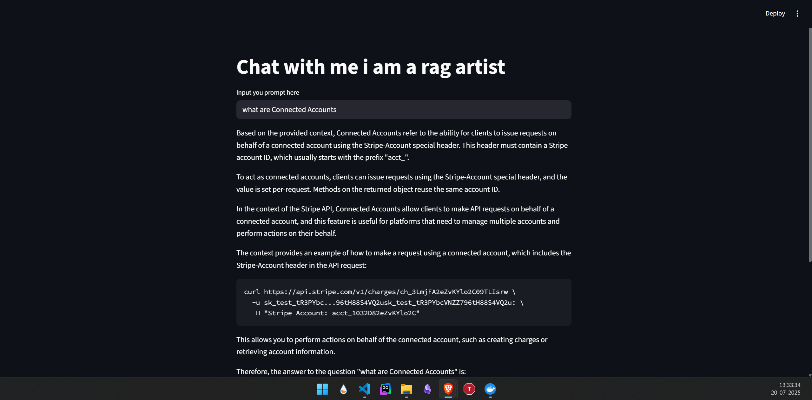

# ⚡ DocQuery: My Personal AI Doc Assistant ⚡

This is my personal tool for speed-reading API documentation. I built it because I was tired of endlessly scrolling through dense docs trying to find that one specific function or parameter. This app lets me ingest any online documentation and ask it direct questions, getting fast, accurate answers sourced directly from the content.

It's powered by the insane speed of **Groq**, the powerful orchestration of **LangChain**, and a completely local **RAG** pipeline for retrieval.

---

## 🤔 Why I Built This

Let's be real: reading technical documentation can be a slog. You know the information is in there somewhere, but finding it is a different story. I wanted a tool where I could just *ask* the docs what I need to know.

This project solves that. I can point it at a URL, let it work its magic, and then use the simple chat interface to query the content. It’s like having a conversation with the documentation, which makes learning a new API or framework so much faster.

---

## 🛠️ How It Works: The "Technical Shit" Explained



This isn't just a simple chatbot. It’s a full Retrieval-Augmented Generation (RAG) system I put together to be fast, private, and efficient. Here’s a breakdown of the stack:

* **The Core Idea (RAG)**
    **Retrieval-Augmented Generation** is the brains of the operation. Instead of just asking a generic LLM that might have outdated info, my app first *retrieves* the most relevant information directly from the documentation I provided. It then *augments* the LLM's prompt with this context, ensuring the answer is based on facts, not guesswork.

* **The Orchestrator (LangChain)**
    **LangChain** is the glue that holds everything together. It’s a framework that simplifies chaining together all the different components of the RAG pipeline. I use it to manage the entire flow: loading the web page, splitting the text, creating the embeddings, querying the vector store, and calling the Groq LLM.

* **The Speed Demon (Groq)**
    For the final answer generation, I'm using the **Groq API**. Groq doesn’t build LLMs; they build ridiculously fast hardware to run them (Language Processing Units or LPUs). This means when I ask a question, the response is almost instantaneous. That low latency is crucial for a smooth, conversational experience.

* **The Knowledge Base (Embeddings & FAISS)**
    To make the documents searchable, I first need to convert the text into numerical representations called **embeddings**. This is done using a `sentence-transformers` model that runs locally on my machine. These embeddings are then loaded into **FAISS (Facebook AI Similarity Search)**, a hyper-efficient library that stores these vectors and can find the most similar ones to my query in milliseconds. The best part? It all runs locally on the CPU.

* **The User Interface (Streamlit)**
    The entire frontend is a simple **Streamlit** app. It provides the clean, interactive web interface for me to input a URL and ask questions without needing to write any HTML or JavaScript.

---

## 🚀 My Workflow

My process when using the app is simple and effective:

1.  **Run the App**: I start the Streamlit server.
2.  **Load the Docs**: The app ingests the content from a target URL (like an API documentation page).
3.  **Process & Store**: It automatically splits the text, generates embeddings, and builds the FAISS vector store in memory.
4.  **Ask Away**: I type my question into the input box (e.g., "How do I create a stuff documents chain?").
5.  **Get an Answer**: The app finds the relevant chunks from the docs, sends them to Groq for summarization, and displays the answer right in the UI, complete with the source snippets it used.

---

## 💻 How to Run It

#### 1. Clone the Repo
```bash
git clone <your-repo-url>
cd <your-repo-folder>